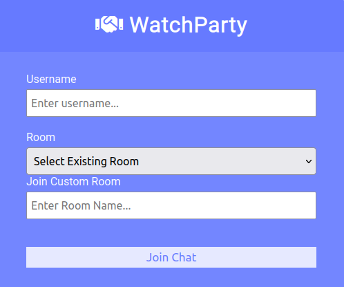
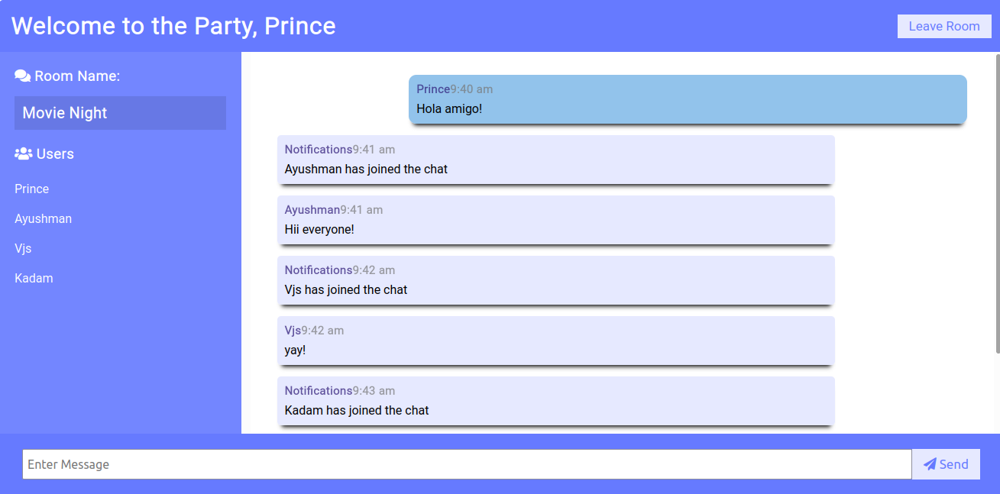

# Watch Party Application
We have built a watch party application in which users can remotely join a room and watch the youtube videos of their choice. Following features are available in the application:

## Rooms

A room is a designated virtual channel where users with common interests can communicate and watch youtube videos of their choice. A user can join two types of room:
- inbuilt rooms
- custom rooms:
    - Room Creator: One User has to create a new room by providing a name. They can then share this name with the intended attendees of the watch party.
    - Room User: Any User who wishes to be part of a given room can join the room by entering the room name.

## Chat Features
After joining a given room, you can view the usernames of the online users. You can chat with the group by entering the messages.

## Custom Youtube link
You can provide any youtube link and it will play for all the online users.

## Synchronizing
Whenever a user does any event on the youtube video like play,pause,forward and backward. This generated event is broadcasted to all online users and the video is in synchronization at all times.

